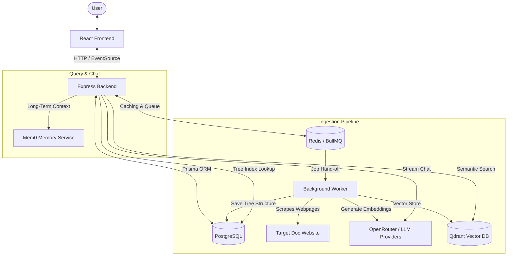
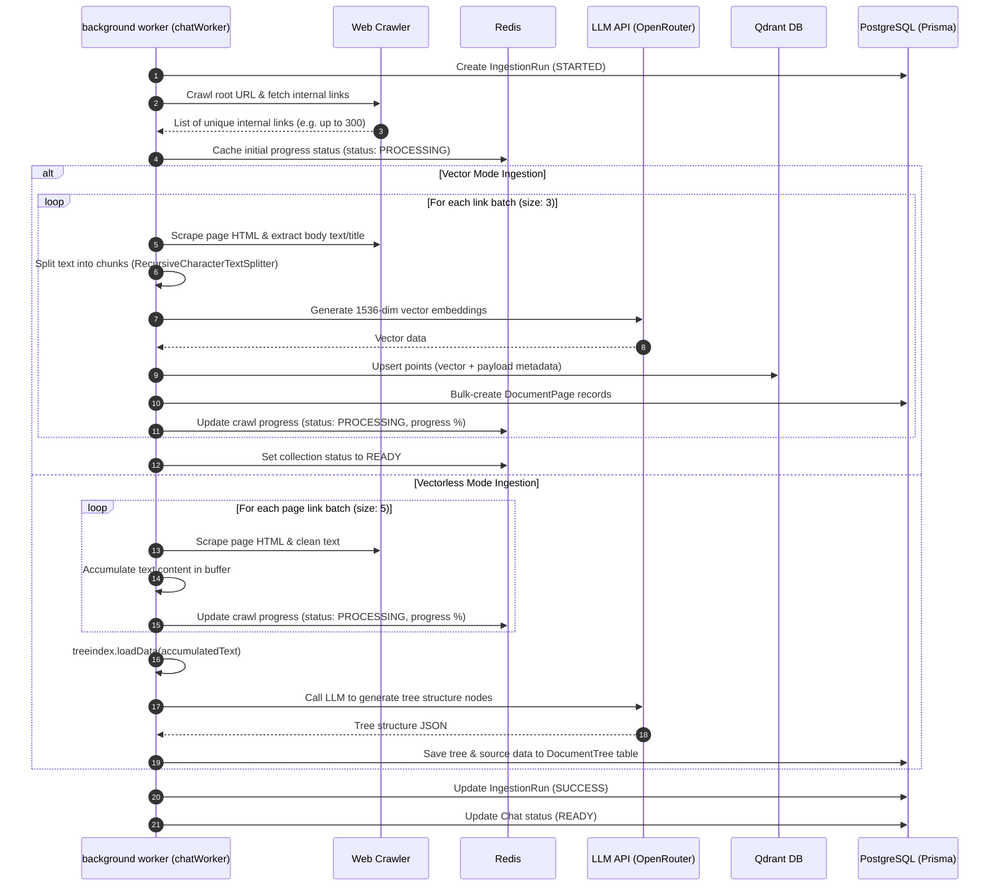
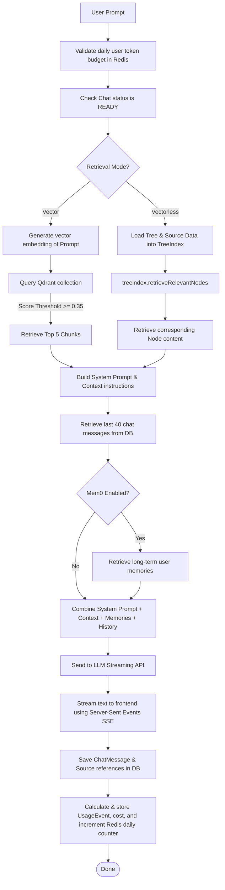

# DocChat Architecture Guide

This document provides a detailed overview of the system architecture, pipelines, and data flows of DocChat.

---

## High-Level System Architecture

DocChat is a Retrieval-Augmented Generation (RAG) web application structured around a React frontend and a Node.js Express backend. It utilizes Redis for background job queue management (BullMQ) and ingestion status caching, PostgreSQL for relational data persistence, and Qdrant for vector embeddings storage.

---

## 1. Data Ingestion Pipeline

The data ingestion pipeline allows users to convert documentation websites into a searchable knowledge base. DocChat supports two indexing modes: **Vector** (using similarity embeddings stored in Qdrant) and **Vectorless** (using a hierarchical structural tree stored in PostgreSQL via `treeindex`).

### Step 1: Expectation Calculation (Pre-Ingestion)
Before performing full ingestion, the system estimates the token count and cost, and checks if the URL has already been processed:
1. User requests expectations for a URL via `/api/v1/chat/expectation?docsUrl=...`.
2. Backend queries `ChatSource` in PostgreSQL. If the URL has already been ingested in that mode, it returns `alreadyIngested: true` (no cost, zero wait time).
3. If not ingested, the backend scrapes the root page and gets up to 10 sample internal links.
4. It scrapes these sample pages to calculate an average body length, extrapolates it over the total link count (capped at 300 by default), and calculates:
   * $\text{Expected Tokens} = \frac{\text{Average Body Length} \times \text{Total Links}}{3.8}$
   * $\text{Expected Cost} = \frac{\text{Expected Tokens}}{1,000,000} \times \$0.02$
5. These details are returned to the frontend to show the user a preview.

### Step 2: Chat Creation & Queue
1. User clicks **Create Chat**. The frontend sends a request to `/api/v1/chat/create` with the target URL, retrieval mode (`isVectorLess`), and optional crawl limit (`scrapeLimit`).
2. Backend checks if a unique `ChatSource` matching `(documentationUrl, isVectorLess)` exists.
   * **If exists**: The backend instantly connects the new `Chat` to the existing `ChatSource` and returns status `READY`.
   * **If new**: The backend creates a new `ChatSource`, sets the `Chat` status to `QUEUED`, creates an `IngestionRun` record, and adds a job to the BullMQ queue (`chatCreation`).
3. The server immediately returns the `chatId` to the frontend without blocking.

### Step 3: Background Worker Processing (`chatWorker.js`)
The worker picks up the job and executes either Vector Ingestion or Vectorless Ingestion depending on the `isVectorLess` flag:

---

## 2. Retrieval & Chat Pipeline

When a user submits a prompt, DocChat retrieves relevant context chunks, constructs a history-aware prompt, streams the response from the LLM, and logs token usage.

### Context Construction & Prompt Engineering
The function `buildMessagesForLLM` in [contextBuilder.js](file:///c:/Users/Rushabh%20Mahajan/Documents/GitHub/DocChat/backend/utils/contextBuilder.js) formats the final messages payload sent to the LLM:
1. **System Prompt**: Declares the assistant's persona, commands conciseness, dictates markdown format, and enforces: *"Use the provided documentation sources to answer. If the answer isn't in the sources, say you don't know."*
2. **Scraped Context**:
   * For **Vector mode**: Embeds the context chunks inside `<doc-source>` XML tags, displaying the page title, URL, and matching text fragment.
   * For **Vectorless mode**: Embeds retrieved tree nodes inside `<tree-node>` XML tags containing the structural text blocks.
3. **Memories**: Adds a small block of user preferences derived from past chats retrieved via Mem0 (e.g., *"User prefers Python example codes"*).
4. **Chat History**: Appends the last 40 roles (`user` and `assistant`) to provide multi-turn conversation memory.
5. **Latest User Input**: The current prompt input.
